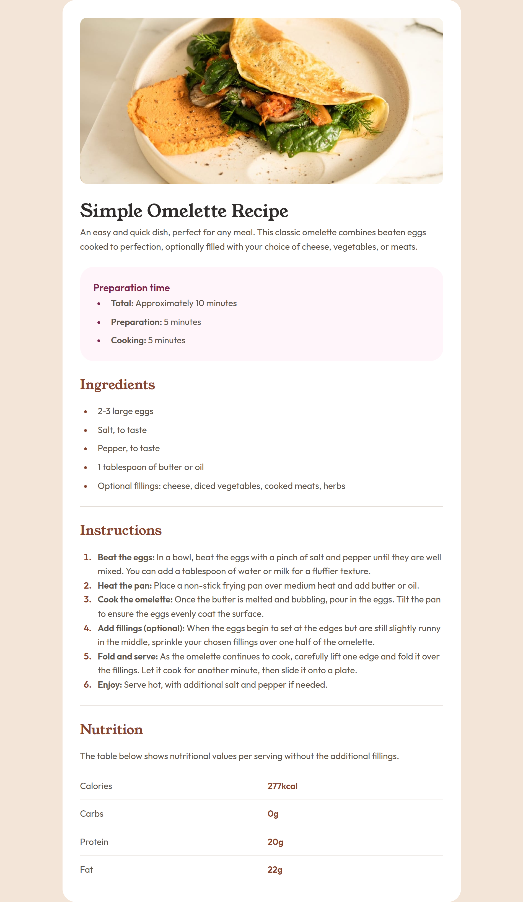

# Frontend Mentor - Recipe page solution

This is a solution to the [Recipe page challenge on Frontend Mentor](https://www.frontendmentor.io/challenges/recipe-page-KiTsR8QQKm). Frontend Mentor challenges help you improve your coding skills by building realistic projects.

## Table of contents

- [Overview](#overview)
  - [The challenge](#the-challenge)
  - [Screenshot](#screenshot)
  - [Links](#links)
- [My process](#my-process)
  - [Built with](#built-with)
  - [What I learned](#what-i-learned)

## Overview

### Screenshot



### Links

- Solution URL: [https://github.com/mnav08/recipe-page]
- Live Site URL: [https://mnav08.github.io/recipe-page/]

## My process

### Built with

- Semantic HTML5 markup
- CSS custom properties
- Flexbox
- Responsive Design

### What I learned

I learned more about design properties for tables

```css
..nutrition table {
  width: 100%;
  border-collapse: collapse; /* removes extra space between cells */
  margin-top: var(--space-3);
}
```

The marker pseudo-selector for bullet points

```css
.prep-time li::marker {
  color: var(--Rose-800);
}
```

Style the hr element

```css
hr {
  border: none; /* Remove default border */
  border-top: 1px solid var(--Stone-150); /* Add your own border */
  margin: var(--space-5) 0;
}
```

## Author

Moises Navas

- Frontend Mentor - [https://www.frontendmentor.io/profile/mnav08]
